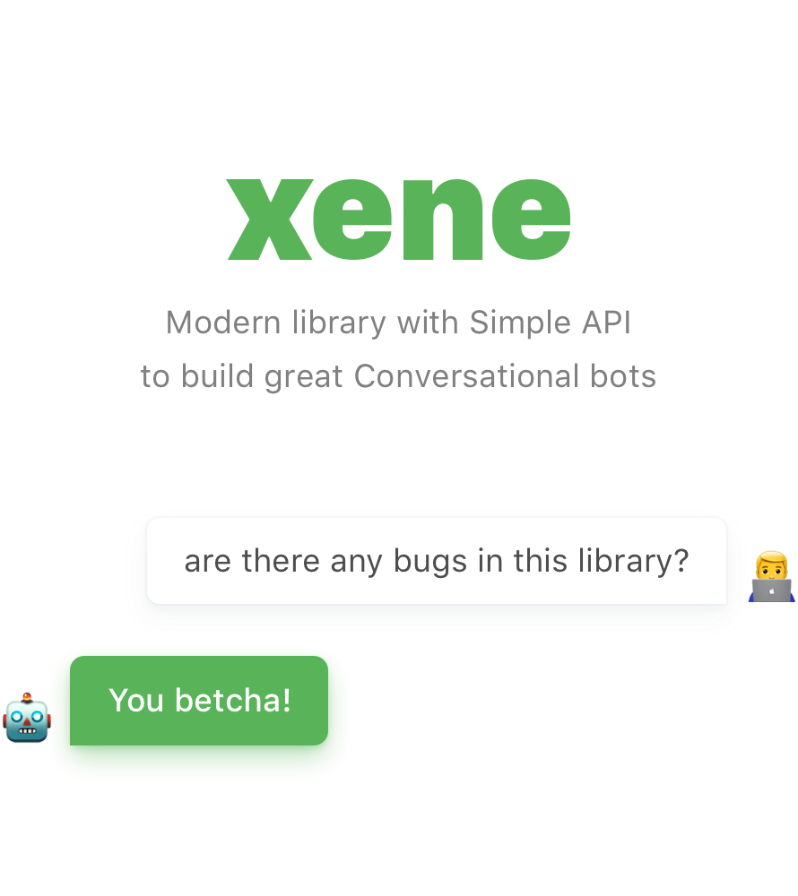
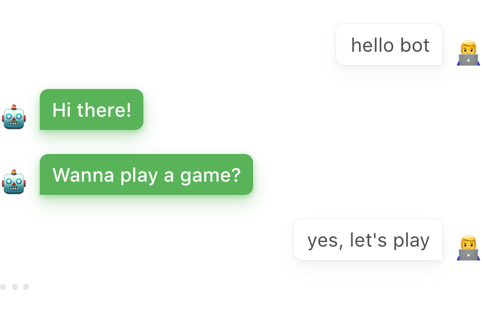
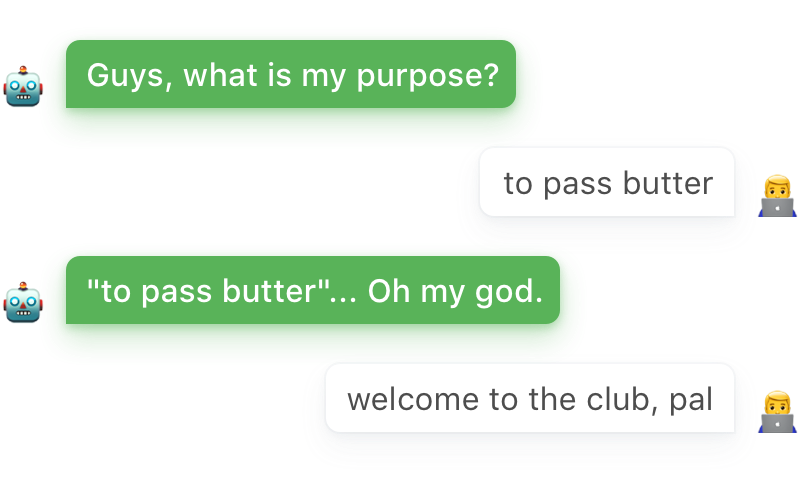
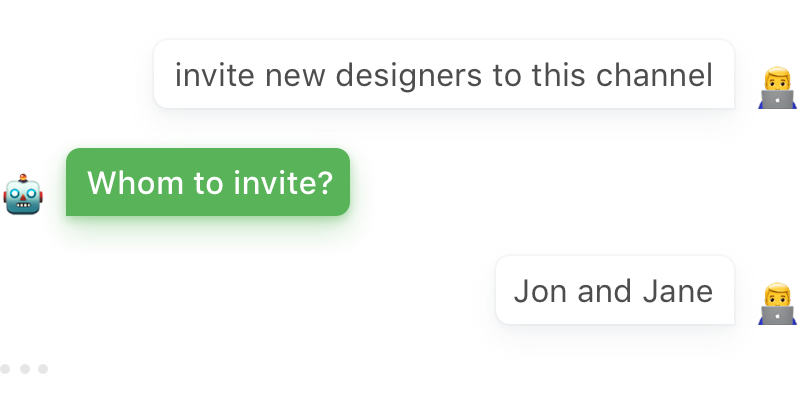
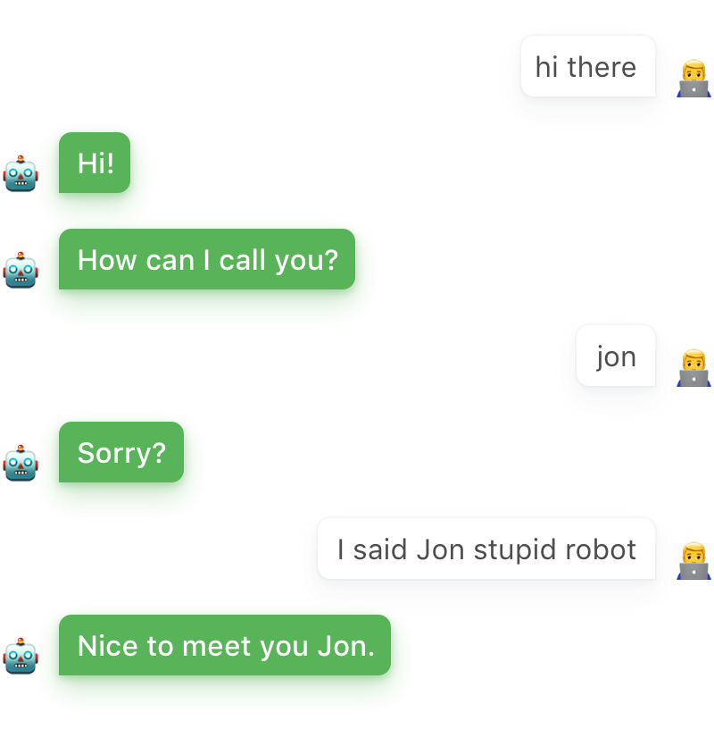
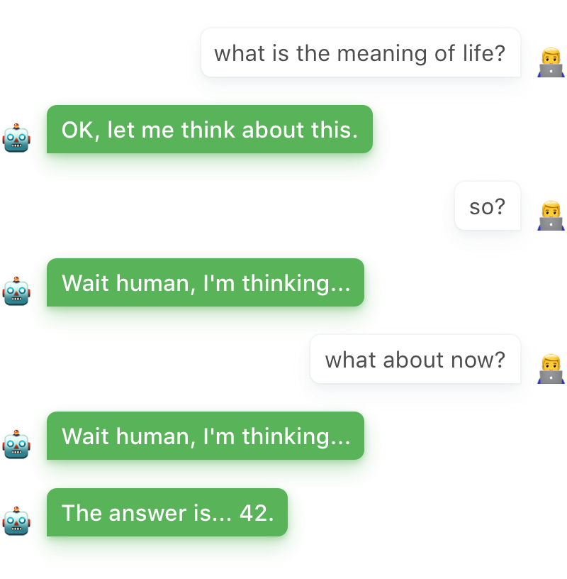

<div align="center"></div>

[](https://travis-ci.org/dempfi/xene) [](https://www.npmjs.com/package/@xene/core) [](http://www.firsttimersonly.com)

Xene is a framework for building conversational bots with modern JavaScript(or
TypeScript). From simple command based bots to rich natural language bots the
framework provides all of the features needed to manage the conversational aspects of a bot.

```js
import { Slackbot } from '@xene/slack'

new Slackbot(/* API token */)
  .when(/hi|hello/i).say('Hi there!')
  .when(/talk/i).talk(async dialog => {
    const user = await dialog.bot.users.info(dialog.user)
    const topic = await dialog.ask('What about?', topicParser)
    await dialog.say(`Ok ${user.profile.firstName}, let's talk about ${topic}.`)
    // ...
  })
  .listen()
```


## 📦 Packages
Xene is split into different packages for different services and purposes.
There are 2 main packages that differ from rest: `@xene/core` and `@xene/test`.

- [`@xene/core`](https://www.npmjs.com/package/@xene/core) is the place where actual conversation API is implemented and all other packages(like
`@xene/slack`) derive from it.
- [`@xene/test`](https://www.npmjs.com/package/@xene/test) defines a convenient
wrapper to help you test your bots. It works nicely with all other packages
(Slack or Telegram).
- [`@xene/slack`](https://www.npmjs.com/package/@xene/slack) provides
`Slackbot` which provides all features to build communication and it also
provides all [api methods of Slack](https://api.slack.com/methods) with
promises and in camel case 🙂
- `@xene/telegram` is still in progress but will be as smooth as Slackbot 😉


## 💬 Talking

Xene provides two main ways to talk with users — in response to some users'
message and a way to start talking completely programmatically.

### 📥 In response to message
To talk with a user when a user says something, first of all, we need to match
user's message. Xene bots provide `.when()` method for this.

```js
import { Slackbot } from '@xene/slack'

new Slackbot(/* API token */)
  .when(/hi|hello/i).talk(dialog => /* ... */)
```

Once user says something that matches, callback passed to `.talk()` will be
invoked with an instance of `Dialog` class. Which provides three main methods
to parse something from most recent users' message(`dialog.parse()`), to say
something to user(`dialog.say()`) and to ask a question to which user can reply
(`dialog.ask()`). Read more about them and Dialog [here](#dialog).

```js
import { Slackbot } from '@xene/slack'

new Slackbot(/* API token */)
  .when(/hi|hello/i).talk(async dialog => {
    await dialog.say('Hi there!')
    const play = await dialog.ask('Wanna play a game?', reply => /yes/i.test(reply))
    // start a game...
  })
```
<div align="center"></div>

### 📤 Initiate proactively

The dialog can also be created proactively when you need them. To do so you can
call `bot.dialog()` method. It expects chat id (slack channel would do) and an
array of users' ids. Rest is the same as in the above example.

```js
import { Slackbot } from '@xene/slack'

const bot = new Slackbot(/* API token */)

const getGloriousPurpose = async () => {
  const dialog = bot.dialog('#chat-id', ['@user1-id', '@user2-id'])
  const purpose = await dialog.ask('Guys, what is my purpose?', reply => reply)
  const comment = purpose === 'to pass butter' ? 'Oh my god.' : 'Nice.'
  await dialog.say(`"${purpose}"... ${comment}`)
  bot.purpose = purpose
  dialog.end()
}

getGloriousPurpose()
```

<div align="center"></div>

### ⚙️ Dialog API
In the examples above we've been dealing with instances of `Dialog` class.
It provides following methods and properties.

#### .bot: Bot
The instance of the `Bot` to which dialog belongs to
```js
dialog.bot
```

#### .chat: string
The unique id of a chat where the dialog is happening.
```js
dialog.chat
```

#### .users: Array\<string>
An array of ids of all users to whom dialog is attached to.
```js
dialog.users
```

#### .user: string
The id of the primary user to whom dialog is attached to.
```js
dialog.user
```

#### .on(event: string, callback: function)
Add an event listener to life cycle events of a dialog.
```js
dialog.on('end', _ => console.log('Dialog has ended.'))
dialog.on('abort', _ => console.log('Dialog was aborted by user.'))
dialog.on('pause', _ => console.log('Dialog was paused.'))
dialog.on('unpause', _ => console.log('Dialog was unpaused.'))
dialog.on('incomingMessage', m => console.log(`Incoming message ${JSON.stringify(m)}`))
dialog.on('outgoingMessage', m => console.log(`Outgoing message ${JSON.stringify(m)}`))
```

#### .end()
Abort dialog, use this to stop dialog. For example when users asks to.
```js
dialog.on('abort', _ => dialog.end())
```

#### .say(message: Message, [unpause: Boolean = true])
Send a message to chat, type of the message depends on the bot to which dialog
belongs to. For Slackbot message can be either `string` or message object
described [here](https://api.slack.com/methods/chat.postMessage).

`unpause` option is optional it's here to help you to control whether dialog
should be unpaused when bot says something or not. By default it's true and
dialog will be unpaused. [Read more about pasue.](#pause)

```js
dialog.say('Hello world!')
dialog.pause('Paused!')
dialog.say('Hi again', false)
```

#### .parse(parser: Function || { parse: Function, isValid: Function } , [onError: Message || Function])
Parse the most recent message from the user. This method accepts one or two arguments.

If an error handler isn't provided, this method will return the result of the first attempt
to apply parser even if it's an undefined.
```js
new Slackbot(/* API token */)
  .when(/hi/i).talk(async dialog => {
    await dialog.say('Hi!')
    const parser = reply => (reply.match(/[A-Z][a-z]+/) || [])[0]
    const name = await dialog.parse(parser)
    if (!name) await dialog.say("I didn't get your name, but it's OK.")
    else await dialog.say(`Nice to meet you ${name}.`)
  })
```

<div align="center"></div>

If there is an error handler xene will call it for every failed attempt to parse
user's message. Xene counts all parsing failed if `null` or `undefined` were
returned from parser function. To fine tune this behavior you can pass an object
as a parser with two methods — `parse` and `isValid`. Xene will call `isValid` to determine if parsing failed.

```js
new Slackbot(/* API token */)
  .when(/invite/i).talk(async dialog => {
    const parser = {
      parse: reply => reply.match(/[A-Z][a-z]+/),
      isValid: parsed => parsed && parsed.length
    }
    const names = await dialog.parse(parser, 'Whom to invite?')
    // ...
  })
```

<div align="center"></div>

#### .ask(question: Message, parser: Function || { parse: Function, isValid: Function }, [onError: Message || Function])
Ask the `question` to user and parse response from user to the question. If
parsing fails and error handler `onError` is defined it will be called. If
error handler `onError` isn't defined than question will be asked again.

```js
new Slackbot(/* API token */)
  .when(/hi/i).talk(async dialog => {
    await dialog.say('Hi!')
    const parser = reply => (reply.match(/[A-Z][a-z]+/) || [])[0]
    const name = await dialog.ask('How can I call you?', parser, 'Sorry?')
    await dialog.say(`Nice to meet you, ${name}.`)
  })
```
<div align="center"></div>
This example also shows us importance of better parser then one based on capital letter in front of the words 😅.

#### .pause(message: Message)
Reply to all incoming user's messages with `message` until dialog is unpaused.
Dialog unpauses when a message is sent to user or question is asked(`.say()`
and `.ask()` methods). This method can help your bot to give status to user during some have calculations which takes some time.

```js
new Slackbot(/* API token */)
  .when(/meaning of life/i).talk(async dialog => {
    dialog.pause(`Wait human, I'm thinking...`)
    await dialog.say('OK, let me think about this.', false)
    await new Promise(resolve, setTimeout(resolve, 24 * 60 * 60 * 1000)) // wait 24 hours
    await dialog.say('The answer is... 42.')
  })
```
<div align="center"></div>


## ✅ Testing


#### TypeScript
Xene is written in TypeScript and npm package already includes all typings.
